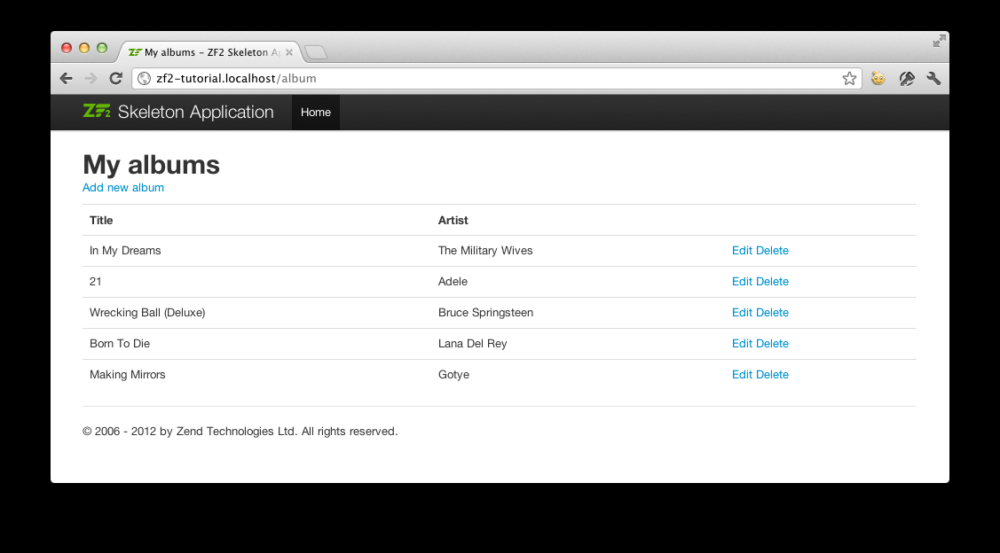

# 数据和模型

## 数据库

通过控制器动作方法和视图脚本，建立了 `Album` 模块，是时候注意到程序中的模型部分了。记住，模型是解决程序核心目的的一部分（也将模型称之为业务规则），在本例中，也是数据处理的一部分。使用 Zend Framework 中的 `Zend\Db\TableGateway\TableGateway` 类，这个类是用来查找，插入，更新和删除数据库中表的记录的。

通过 PHP 的 PDO 驱动，使用 MySQL，故，创建名为 `zf2tutorial` 数据库，然后运行 SQL 语句创建一个 album 表,并插入一些数据。

```php
CREATE TABLE album (
   id int(11) NOT NULL auto_increment,
   artist varchar(100) NOT NULL,
   title varchar(100) NOT NULL,
   PRIMARY KEY (id)
 );
 INSERT INTO album (artist, title)
     VALUES  ('The  Military  Wives',  'In  My  Dreams');
 INSERT INTO album (artist, title)
     VALUES  ('Adele',  '21');
 INSERT INTO album (artist, title)
     VALUES  ('Bruce  Springsteen',  'Wrecking Ball (Deluxe)');
 INSERT INTO album (artist, title)
     VALUES  ('Lana  Del  Rey',  'Born  To  Die');
 INSERT INTO album (artist, title)
     VALUES  ('Gotye',  'Making  Mirrors');
```

所选择的测试数据是英国亚马逊畅销书的相关信息!

现在数据库中有了一些数据，可以为其编写一个简单的模型。

## 模型文件

Zend Framework 没有提供 `Zend\Model` 控件，因为模型是你的业务逻辑，取决于你想让它如何工作。根据你的需求，这里任然有很多控件可以供你使用。一种方法是，在你的程序中模型类对应一种实体，然后使用映射器对象来加载和存储实体到数据库。另一种是使用对象关系映射计算，例如 Doctrine 或者 Propel。

在这个向导中，每一个 album 就是一个 `Album` 对象（或者说是实体），通过使用 `Zend\Db\TableGateway\TableGateway` 构建一个 `AlbumTable` 类，然后使用 `AlbumTable` 构建一个简单的模型。在数据库的表中，Table Data Gateway 的设计模式可以实现数据接口。请注意，虽然 Table Data Gateway 模式在大系统中可能会被限制。但这个也是个诱惑，如果你把数据库访问代码放进控制器的动作方法，`Zend\Db\TableGateway\AbstractTableGateway` 这个类就会暴露这些代码。请不要这么做！

在 `module/Album/src/Album/Model` 路径下新建一个 `Album.php` ：

```php
namespace Album\Model;

class Album
{
    public $id;
    public $artist;
    public $title;

    public function exchangeArray($data)
    {
        $this->id     = (!empty($data['id'])) ? $data['id'] : null;
        $this->artist = (!empty($data['artist'])) ? $data['artist'] : null;
        $this->title  = (!empty($data['title'])) ? $data['title'] : null;
    }
}
```

`Album` 实体对象是一个简单的 PHP 类。为了与 `Zend\Db` 的 `TableGateway` 类一起工作。需要实现 `exchangeArray()` 方法。这个方法简单地将 data 数组中的数据拷贝到对应实体属性。

下一步，在 `module/Album/src/Album/Model` 目录下新建 `AlbumTable.php`，内容如下：

```php
namespace Album\Model;

use Zend\Db\TableGateway\TableGateway;

class AlbumTable
{
    protected $tableGateway;

    public function __construct(TableGateway $tableGateway)
    {
        $this->tableGateway = $tableGateway;
    }

    public function fetchAll()
    {
        $resultSet = $this->tableGateway->select();
        return $resultSet;
    }

    public function getAlbum($id)
    {
        $id  = (int) $id;
        $rowset = $this->tableGateway->select(array('id' => $id));
        $row = $rowset->current();
        if (!$row) {
            throw new \Exception("Could not find row $id");
        }
        return $row;
    }

    public function saveAlbum(Album $album)
    {
        $data = array(
            'artist' => $album->artist,
            'title'  => $album->title,
        );

        $id = (int) $album->id;
        if ($id == 0) {
            $this->tableGateway->insert($data);
        } else {
            if ($this->getAlbum($id)) {
                $this->tableGateway->update($data, array('id' => $id));
            } else {
                throw new \Exception('Album id does not exist');
            }
        }
    }

    public function deleteAlbum($id)
    {
        $this->tableGateway->delete(array('id' => (int) $id));
    }
}
```

这里做了许多事情。首先，我们在构造函数中设置了保护属性 `$tableGateway` 为 `TableGateway` 的实例。我们将使用这个来属性操作数据库的 album 表。

继续创建一些帮助方法，程序会使用 table gateWay 和这个实例。`fetchAll()` 检索数据库中 albums 表所有的记录，然后将结果返回 `ResultSet`，`getAlbum()` 通过 id 检索一个 `Album` 对象，`saveAlbum()`要么创建一个新的记录，或更新已经存在记录，`deleteAlbum()`移除一条记录。这些代码自解释的。

## 使用 ServiceManager 来配置 table gateway 然后注入到 AlbumTable 

为了总是使用同一个的 `AlbumTable` 实例，我们将使用 `ServiceManager` 来定义如何创建。最容易的是，在模块类中，我们创建一个名为 `getServiceConfig()` 的方法，它可以被 `ModuleManager` 自动调用，适用于 `ServiceManager`。然后，当我们需要它的时候，就可以取回它。

为了配置 `ServiceManager`，在 `ServiceManager` 需要的时候，我们提供一个类的名字或者一个工厂（闭包或者回调），来产生实例化的对象。我们通过实现 `getServiceConfig()` 来提供一个工厂，这个工厂用来创建一个 `AlbumTable`。添加这个方法到 `module/Album` 目录下的 `Module.php` 文件的底部。

```php
namespace Album;

// Add these import statements:
use Album\Model\Album;
use Album\Model\AlbumTable;
use Zend\Db\ResultSet\ResultSet;
use Zend\Db\TableGateway\TableGateway;

class Module
{
    // getAutoloaderConfig() and getConfig() methods here

    // Add this method:
    public function getServiceConfig()
    {
        return array(
            'factories' => array(
                'Album\Model\AlbumTable' =>  function($sm) {
                    $tableGateway = $sm->get('AlbumTableGateway');
                    $table = new AlbumTable($tableGateway);
                    return $table;
                },
                'AlbumTableGateway' => function ($sm) {
                    $dbAdapter = $sm->get('Zend\Db\Adapter\Adapter');
                    $resultSetPrototype = new ResultSet();
                    $resultSetPrototype->setArrayObjectPrototype(new Album());
                    return new TableGateway('album', $dbAdapter, null, $resultSetPrototype);
                },
            ),
        );
    }
}
```

这个方法返回 `factories` 的数组，在传递给 `ServiceManager` 之前，通过 `ModuleManager` 进行合并。`Album\Model\AlbumTable` 的工厂使用 `ServiceManager` 来创建一个 `AlbumTableGateway` 对象，以便传递到 `AlbumTable` 对象。一般会告知 `ServiceManager` 对象，`AlbumTableGateway` 对象的创建是通过得到一个 `Zend\Db\Adapter\Adapter`对象（也是从 `ServiceManager` 获取）来完成的，然后使用 `AlbumTableGateway` 对象来创建一个 `TableGateway` 对象。`TableGateway` 对象每当他创建一条新记录时，都会告知一个 `Album` 对象。`TableGateway ` 类使用原型模式创建结果集和实体。这意味着在请求的时候不是实例化，而是系统克隆先前实例化的对象。参考 [PHP Constructor Best Practices and the Prototype Pattern](http://ralphschindler.com/2012/03/09/php-constructor-best-practices-and-the-prototype-pattern)。

最终，我们需要配置 `ServiceManager`，让其知道如何获取 `Zend\Db\Adapter\Adapter`。这是通过使用一个工厂类 `Zend\Db\Adapter\AdapterServiceFactory`，我们能在合并配置系统中配置它。Zend Framework 2 的 `ModuleManager` 合并每一个模块的 `module.config.php` 文件中所有的配置，然后合并导出到 `config/autoload` 下的文件（`*.global.php` 和 `*.local.php` 文件）。我们将添加我们的数据库配置信息到 `global.php` 这个文件，这个文件应该提交到你的版本控制系统。如果你想的话，现在可以使用 `local.php` （版本控制系统之外的）来存储数据库的证书。修改 `config/autoload/global.php` （在 Zend 骨架的根下，并不在 Album 模块中），代码如下：

```php
return array(
     'db' => array(
         'driver'         => 'Pdo',
         'dsn'            => 'mysql:dbname=zf2tutorial;host=localhost',
         'driver_options' => array(
             PDO::MYSQL_ATTR_INIT_COMMAND => 'SET NAMES \'UTF8\''
         ),
     ),
     'service_manager' => array(
         'factories' => array(
             'Zend\Db\Adapter\Adapter'
                     => 'Zend\Db\Adapter\AdapterServiceFactory',
         ),
     ),
 );
```

你应该将你的数据库证书放到 `config/autoload/local.php`，所以他们不是在 git 存储库（就像 `local.php` 会被忽略）：

```php
return array(
     'db' => array(
         'username' => 'YOUR USERNAME HERE',
         'password' => 'YOUR PASSWORD HERE',
     ),
 );
```

## 回到控制器

现在 `ServiceManager` 可以创建一个 `AlbumTable` 实例了，我们可以添加一个方法到控制器去见检索它。添加 `getAlbumTable()` 到 `AlbumController` 类中：

```php
// module/Album/src/Album/Controller/AlbumController.php:
     public function getAlbumTable()
     {
         if (!$this->albumTable) {
             $sm = $this->getServiceLocator();
             $this->albumTable = $sm->get('Album\Model\AlbumTable');
         }
         return $this->albumTable;
     }
```

你也应该添加下面这句：

```php
protected $albumTable;
```

每当我们需要与模型进行交互的时候，就可以在控制器中调用 `getAlbumTable()`。

如果服务定位器在 `Module.php` 中正确配置，那么在调用 `getAlbumTable()` 时将会拿到一个 `Album\Model\AlbumTable` 实例。

## 列举 albums

为了列举 albums，我们需要从模型中检索他们然后传递到视图。为此，我们在 `AlbumController` 填写 `indexAction()`。更新 `AlbumController` 的 `indexAction()` 方式如下：

```php
// module/Album/src/Album/Controller/AlbumController.php:
 // ...
     public function indexAction()
     {
         return new ViewModel(array(
             'albums' => $this->getAlbumTable()->fetchAll(),
         ));
     }
 // ...
```

在 Zend Framework 2 中，为了在视图中设置变量，我们返回一个 `ViewModel` 实例，构造函数的第一个参数是一个来自动作的数组，包含我们需要的数据。然后会自动传递到视图脚本。ViewModel 对象还允许我们改变视图脚本,但是默认是使用`{controller name}/{action name}`。我们现在可以填写视图脚本 `index.phtml`。

```php
<?php
 // module/Album/view/album/album/index.phtml:

 $title = 'My albums';
 $this->headTitle($title);
 ?>
 <h1><?php echo $this->escapeHtml($title); ?></h1>
 <p>
     <a href="<?php echo $this->url('album', array('action'=>'add'));?>">Add new album</a>
 </p>

 <table class="table">
 <tr>
     <th>Title</th>
     <th>Artist</th>
     <th>&nbsp;</th>
 </tr>
 <?php foreach ($albums as $album) : ?>
 <tr>
     <td><?php echo $this->escapeHtml($album->title);?></td>
     <td><?php echo $this->escapeHtml($album->artist);?></td>
     <td>
         <a href="<?php echo $this->url('album',
             array('action'=>'edit', 'id' => $album->id));?>">Edit</a>
         <a href="<?php echo $this->url('album',
             array('action'=>'delete', 'id' => $album->id));?>">Delete</a>
     </td>
 </tr>
 <?php endforeach; ?>
 </table>
```

第一件事是我们要为页面设置标题，标题可以在浏览器的标题栏现在，可以在 `<head>` 部分使用视图帮助方法 `headTitle()` 来进行设置标题。然后我们添加一个连接到新的 album。

Zend Framework 2 提供了视图帮助方法 `url()`，用来创建 URL。`url()` 的第一个参数是 route，用来创建 URL，第二个参数是所有变量的数组，用来填充字段的。在本例中，我们使用 ‘album’ route以及设置两个字段变量 `action` 和 `id`。

我们遍历了 `$albums` 中从控制器分配的动作。Zend Framework 2 视图系统自动确认了填充到视图脚本域的变量，所以我们不用担心还要像旧框架 Zend Framework 1 中那样使用前缀 `$this->` 来区别变量，当然你仍然可以在这么做。

然后创建一个表格来展示每一个 album 的标题和艺术家，提供一些链接，用以修改和删除记录。一个标准的变量是：使用迭代器循环遍历 albums 的列表，我们交替使用冒号和 endforeach 的形式；相对于尝试匹配括号，这就可以十分简单访问元素了。再一次使用视图帮助方法 `url()` 来创建修改和删除链接。

> **注意**

> 我们可以使用视图帮助方法 `escapeHtml()` 来辅助保护我们自己的跨站脚本的缺陷。（详情查看[http://en.wikipedia.org/wiki/Cross-site_scripting](http://en.wikipedia.org/wiki/Cross-site_scripting)）

如果你打开 `http://zf2-tutorial.localhost/album`，就能看到如下效果：


