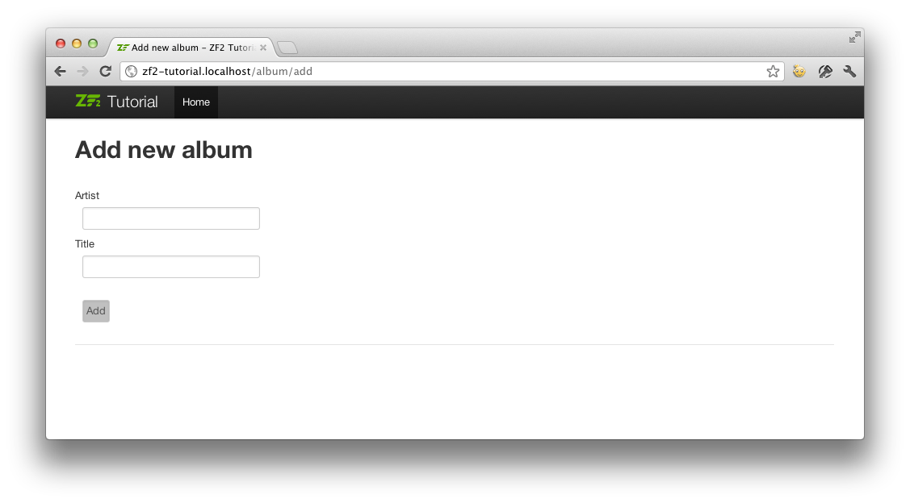

# 表单和动作

## 添加新的 album

我们现在可以添加新 albums 代码的功能。这分为两个部分：

* 展示表单给用户，提供细节

* 处理表单提交并存储到数据库

我们用 `Zend\Form` 来处理这些。`Zend\Form`  控件管理表单和处理表单验证，添加一个 `Zend\InputFilter` 到 `Album` 实体。开始写我们的新类 `Album\Form\AlbumForm`，这个类继承自 `Zend\Form\Form`。在 `module/Album/src/Album/Form` 目录下新建一个 `AlbumForm.php` 文件，内容如下：

```php
namespace Album\Form;

use Zend\Form\Form;

class AlbumForm extends Form
{
    public function __construct($name = null)
    {
        // we want to ignore the name passed
        parent::__construct('album');

        $this->add(array(
           'name' => 'id',
            'type' => 'Hidden',
        ));
        $this->add(array(
            'name' => 'title',
            'type' => 'Text',
            'options' => array(
                'label' => 'Title',
            ),
        ));
        $this->add(array(
            'name' => 'artist',
            'type' => 'Text',
            'options' => array(
                'label' => 'Artist',
            ),
        ));
        $this->add(array(
            'name' => 'submit',
            'type' => 'Submit',
            'attributes' => array(
                'value' => 'Go',
                'id' => 'submitbutton',
            ),
        ));
    }
}
```

在 `AlbumForm` 的构造函数中，我们需要做一些事情。首先我们要设置表单的名字，调用父类构造函数。接着我们创建四个表单元素：id，title，artist，以及提交按钮。对每一项，我们都要设置各种各样的属性和设置，包括要显示的标签。

> **注意**

> HTML-Forms 可以使用 `POST` 和 `GET` 来发送。ZF2s 默认使用 `POST`，因此你不必显式的设置这个选项。如果你想改成 `GET`，你所做的就是需要在构造函数中指定。

> `$this->setAttribute('method', 'GET');`

我们需要为表单设置验证。在 Zend Framework 2，验证通过使用输入过滤器处理，这个过滤器可以是独立的或者可以在类中定义。它继承自 `InputFilterAwareInterface` 接口类，就像一个模型实体。在本例中，将输入过滤器添加到 Album 类，`module/Album/src/Album/Model` 路径下的 `Album.php` 文件修改如下：

```php
namespace Album\Model;

// Add these import statements
use Zend\InputFilter\InputFilter;
use Zend\InputFilter\InputFilterAwareInterface;
use Zend\InputFilter\InputFilterInterface;

class Album implements InputFilterAwareInterface
{
    public $id;
    public $artist;
    public $title;
    protected $inputFilter;                       // <-- Add this variable

    public function exchangeArray($data)
    {
        $this->id     = (isset($data['id']))     ? $data['id']     : null;
        $this->artist = (isset($data['artist'])) ? $data['artist'] : null;
        $this->title  = (isset($data['title']))  ? $data['title']  : null;
    }

    // Add content to these methods:
    public function setInputFilter(InputFilterInterface $inputFilter)
    {
        throw new \Exception("Not used");
    }

    public function getInputFilter()
    {
        if (!$this->inputFilter) {
            $inputFilter = new InputFilter();

            $inputFilter->add(array(
                'name'     => 'id',
                'required' => true,
                'filters'  => array(
                    array('name' => 'Int'),
                ),
            ));

            $inputFilter->add(array(
                'name'     => 'artist',
                'required' => true,
                'filters'  => array(
                    array('name' => 'StripTags'),
                    array('name' => 'StringTrim'),
                ),
                'validators' => array(
                    array(
                        'name'    => 'StringLength',
                        'options' => array(
                            'encoding' => 'UTF-8',
                            'min'      => 1,
                            'max'      => 100,
                        ),
                    ),
                ),
            ));

            $inputFilter->add(array(
                'name'     => 'title',
                'required' => true,
                'filters'  => array(
                    array('name' => 'StripTags'),
                    array('name' => 'StringTrim'),
                ),
                'validators' => array(
                    array(
                        'name'    => 'StringLength',
                        'options' => array(
                            'encoding' => 'UTF-8',
                            'min'      => 1,
                            'max'      => 100,
                        ),
                    ),
                ),
            ));

            $this->inputFilter = $inputFilter;
        }

        return $this->inputFilter;
    }
}
```

`InputFilterAwareInterface` 定义了两方法：`setInputFilter()` 和 `getInputFilter()`。我们需要实现 `getInputFilter()` 方法，而 `setInputFilter()` 只要简单的抛一个异常就行了。

在 `getInputFilter()` 中，实例化一个 `InputFilter`，然后添加我们想要的输入框。
为每个属性对应添加过滤和验证。例如为 `id` 字段添加整型过滤器，为文本元素添加两个过滤器，`StripTags` 和 `StringTrim`，用来移除不想要的 HTML 和不必要的空白字符。还要为这些属性添加 `StringLength`，确保不会输入太多的字符，以便存入数据库。

现在需要获取表单进行显示，然后在提交时进行处理。在 `AlbumController` 的 `addAction()` ：

```php
// module/Album/src/Album/Controller/AlbumController.php:

//...
use Zend\Mvc\Controller\AbstractActionController;
use Zend\View\Model\ViewModel;
use Album\Model\Album;          // <-- Add this import
use Album\Form\AlbumForm;       // <-- Add this import
//...

    // Add content to this method:
    public function addAction()
    {
        $form = new AlbumForm();
        $form->get('submit')->setValue('Add');

        $request = $this->getRequest();
        if ($request->isPost()) {
            $album = new Album();
            $form->setInputFilter($album->getInputFilter());
            $form->setData($request->getPost());

            if ($form->isValid()) {
                $album->exchangeArray($form->getData());
                $this->getAlbumTable()->saveAlbum($album);

                // Redirect to list of albums
                return $this->redirect()->toRoute('album');
            }
        }
        return array('form' => $form);
    }
//...
```

添加 `AlbumForm` 到使用列表之后，我们实现 `addAction()`。看一看 `addAction()` 的内部细节吧：

```php
 $form = new AlbumForm();
 $form->get('submit')->setValue('Add');
```

实例化 `AlbumForm` 然后设置提交按钮的标签为 **Add**。在编辑 album 会使用到不同的标签，就可以复用代码。

```php
 $request = $this->getRequest();
 if ($request->isPost()) {
     $album = new Album();
     $form->setInputFilter($album->getInputFilter());
     $form->setData($request->getPost());
     if ($form->isValid()) {
```

如果 `Request` 对象的 `isPost()` 方法返回真，表明表单已经被提交了。从 album 实例设置表单的输入过滤器，然后我们将报文数据设置到表单中，使用表单对象的 `isValid()` 成员函数来检查数据是否有效。

```php
 $album->exchangeArray($form->getData());
 $this->getAlbumTable()->saveAlbum($album);
```

如果表单是有效的，就从表单中获取数据，使用 `saveAlbum()` 存储到模型中。

```php
// Redirect to list of albums
 return $this->redirect()->toRoute('album');
```

在保存新记录之后，使用重定向控制器插件重定向到 albums 的列表。

```php
 return array('form' => $form);
```

最终，返回我们想指定给视图的变量。在本例中，仅仅是表单对象。注意 Zend Framework 2 也运行返回变量的数组，然后指定给视图，这将会在场景后边创建一个 `ViewModel` 。可以少敲点字。

现在我们需要在 `add.phtml` 视图脚本中渲染表单。

```php
<?php
// module/Album/view/album/album/add.phtml:

$title = 'Add new album';
$this->headTitle($title);
?>
 <h1><?php echo $this->escapeHtml($title); ?></h1>
<?php
$form->setAttribute('action', $this->url('album', array('action' => 'add')));
$form->prepare();

echo $this->form()->openTag($form);
echo $this->formHidden($form->get('id'));
echo $this->formRow($form->get('title'));
echo $this->formRow($form->get('artist'));
echo $this->formSubmit($form->get('submit'));
echo $this->form()->closeTag();
```

我们先展示一个标题，在渲染表单。Zend 框架提供一些视图辅助函数，可以十分简单地完成上诉要求。`form()` 辅助函数有一个  `openTag()` 和 `closeTag()` 方法，用来控制表单的打开和关闭。对每一个元素的标签，可以使用 `formRow()`，但是两个元素太单一了，还要使用 `formHidden()` 和 `formSubmit()`。



二者取其一，渲染表单的过程可以绑定到视图辅助方法 `formCollection` 上。例如，在上面的视图脚本替代所有的表单渲染的输出语句是：

```php
 echo $this->formCollection($form);
```

> 注意：你仍然需要使用 `openTag` 和 `closeTag` 方法来控制表单。上面的代码，你可以替代其他输入语句，调用 `formCollection`。 

这将会对表单结构进行遍历，对每个元素调用合适的标签，元素和视图辅助的错误提示，你通过打开和关闭表单标签包装 formCollection($form)。

现有应该使用程序主页上的 **Add new album** 链接来增加一条新的 album 记录。

## 编辑 album

编辑 album 是添加一个几乎相同的，所以代码都很简单。这次在 `AlbumController` 中使用 `editAction()` ：

```php
// module/Album/src/Album/Controller/AlbumController.php:
//...

    // Add content to this method:
    public function editAction()
    {
        $id = (int) $this->params()->fromRoute('id', 0);
        if (!$id) {
            return $this->redirect()->toRoute('album', array(
                'action' => 'add'
            ));
        }

        // Get the Album with the specified id.  An exception is thrown
        // if it cannot be found, in which case go to the index page.
        try {
            $album = $this->getAlbumTable()->getAlbum($id);
        }
        catch (\Exception $ex) {
            return $this->redirect()->toRoute('album', array(
                'action' => 'index'
            ));
        }

        $form  = new AlbumForm();
        $form->bind($album);
        $form->get('submit')->setAttribute('value', 'Edit');

        $request = $this->getRequest();
        if ($request->isPost()) {
            $form->setInputFilter($album->getInputFilter());
            $form->setData($request->getPost());

            if ($form->isValid()) {
                $this->getAlbumTable()->saveAlbum($album);

                // Redirect to list of albums
                return $this->redirect()->toRoute('album');
            }
        }

        return array(
            'id' => $id,
            'form' => $form,
        );
    }
//...
```

代码看地来很简单。看看表单添加一个 album。首先查找配置 route 中 `id`，然后加载对应的 album，代码如下：

```php
$id = (int) $this->params()->fromRoute('id', 0);
if (!$id) {
    return $this->redirect()->toRoute('album', array(
        'action' => 'add'
    ));
}

// Get the album with the specified id.  An exception is thrown
// if it cannot be found, in which case go to the index page.
try {
    $album = $this->getAlbumTable()->getAlbum($id);
}
catch (\Exception $ex) {
    return $this->redirect()->toRoute('album', array(
        'action' => 'index'
    ));
}
```

`params` 是一个控制器插件，提供一个简便的方式来检索匹配的路由。在 `module.config.php`，我们创建在模块中的 route，使用它来进行检索 `id`。如果 `id` 是零，就会重定向到添加动作，否则，我们继续从数据库中获取 album 实体。

必须检查，确保指定 `id` 的 Album 可以被找到。如果不行，数据访问方法将会抛出异常。捕获该异常并重新输入用户索引页面。

```php
 $form = new AlbumForm();
 $form->bind($album);
 $form->get('submit')->setAttribute('value', 'Edit');
```
表单的 `bind()`方法附着于模型。有如下两个方式：

* 当显示表单时，每个元素的初始值都从模型中提取。

* 在 `isValid()` 成功验证后,表单中的数据推送回模型中。

这些操作通过复合对象完成的。有许多的复合对象，但是只会使用 Zend\Stdlib\Hydrator\ArraySerializable 作为默认复合对象，这个复合对象在模型指定了两个方法：`getArrayCopy()` 和 `exchangeArray()`。我们早已在 Album 实体中写好了 `exchangeArray()`，所以只要写好 `getArrayCopy()`：

```php
// module/Album/src/Album/Model/Album.php:
// ...
    public function exchangeArray($data)
    {
        $this->id     = (isset($data['id']))     ? $data['id']     : null;
        $this->artist = (isset($data['artist'])) ? $data['artist'] : null;
        $this->title  = (isset($data['title']))  ? $data['title']  : null;
    }

    // Add the following method:
    public function getArrayCopy()
    {
        return get_object_vars($this);
    }
// ...
```

复合对象使用 `bind()` 的结果是，我们不用往 `$album` 填充表单的数据，因为已经自动填充好了，只要调用 mappers 的 `saveAlbum()` 来保存修改到数据库。

视图模板，`edit.phtml`，添加一个 album 的如下所示：

```php
<?php
 // module/Album/view/album/album/edit.phtml:

 $title = 'Edit album';
 $this->headTitle($title);
?>
 <h1><?php echo $this->escapeHtml($title); ?></h1>

<?php
$form = $this->form;
$form->setAttribute('action', $this->url(
    'album',
    array(
        'action' => 'edit',
        'id'     => $this->id,
    )
));
$form->prepare();

echo $this->form()->openTag($form);
echo $this->formHidden($form->get('id'));
echo $this->formRow($form->get('title'));
echo $this->formRow($form->get('artist'));
echo $this->formSubmit($form->get('submit'));
echo $this->form()->closeTag();
```

唯一的变化是使用 **Edit Album** 的标题和设置表单的动作到 **edit** 的动作。

现在可以编辑 albums 了。

## 删除 album

为完善我们的程序，我们需要添加删除操作。列表中每一个 album 都有一个删除链接，使用最原始点击方式来对应删除记录。这或许很糟糕，记住使用 HTTP 的规范，执行一个不可撤销的动作，应该使用 POST 而不是使用 GET。

在用户点击删除时，我们要显示一个确认窗口，在用户点击 **yes** 后，就会进行删除。如果表单并不重要，就将代码直接写入视图脚本中（毕竟，`Zend\Form` 是可选！）。

在 `AlbumController::deleteAction()` 写下如下代码：

```php
// module/Album/src/Album/Controller/AlbumController.php:
//...
    // Add content to the following method:
    public function deleteAction()
    {
        $id = (int) $this->params()->fromRoute('id', 0);
        if (!$id) {
            return $this->redirect()->toRoute('album');
        }

        $request = $this->getRequest();
        if ($request->isPost()) {
            $del = $request->getPost('del', 'No');

            if ($del == 'Yes') {
                $id = (int) $request->getPost('id');
                $this->getAlbumTable()->deleteAlbum($id);
            }

            // Redirect to list of albums
            return $this->redirect()->toRoute('album');
        }

        return array(
            'id'    => $id,
            'album' => $this->getAlbumTable()->getAlbum($id)
        );
    }
//...
```

在获取匹配 albums 的表单 id，使用请求对象的 `isPost()` 来决定显示确认页面或者直接删除 album。使用表对象的 `deleteAlbum()` 方法删除记录，然后重定向回到 albums 列表。如果不是 `POST` 请求，我们就会检索修正数据库几级了，然后连同 `id` 返回给视图。

视图脚本的简单表单：

```
<?php
// module/Album/view/album/album/delete.phtml:

$title = 'Delete album';
$this->headTitle($title);
?>
 <h1><?php echo $this->escapeHtml($title); ?></h1>

 <p>Are you sure that you want to delete
    '<?php echo $this->escapeHtml($album->title); ?>' by
    '<?php echo $this->escapeHtml($album->artist); ?>'?
 </p>
<?php
$url = $this->url('album', array(
    'action' => 'delete',
    'id'     => $this->id,
));
?>
 <form action="<?php echo $url; ?>" method="post">
  <div>
    <input type="hidden" name="id" value="<?php echo (int) $album->id; ?>" />
    <input type="submit" name="del" value="Yes" />
    <input type="submit" name="del" value="No" />
  </div>
 </form>
```

在这个脚本中，我们展示一个带有 **Yes** 和 **No** 按钮的确认信息。如果用户点击 **Yes** 我们就会执行删除操作。

## 确保主页显 albums 列表

最后一点。此刻，主页 `http://zf2-tutorial.localhost/` 并没有显示 albums 列表。

这是由于在 `Application` 模块中的 `module.config.php` route 的设置。为了改变设置，打开 `module/Application/config/module.config.php` 找到主页的 route。

```php
 'home' => array(
     'type' => 'Zend\Mvc\Router\Http\Literal',
     'options' => array(
         'route'    => '/',
         'defaults' => array(
             'controller' => 'Application\Controller\Index',
             'action'     => 'index',
         ),
     ),
 ),
```

控制器由 `Application\Controller\Index` 改为 `Album\Controller\Album`。

```php
'home' => array(
     'type' => 'Zend\Mvc\Router\Http\Literal',
     'options' => array(
         'route'    => '/',
         'defaults' => array(
             'controller' => 'Album\Controller\Album', // <-- change here
             'action'     => 'index',
         ),
     ),
 ),
```

就这些了，现在你有一个可以运行的程序了。
