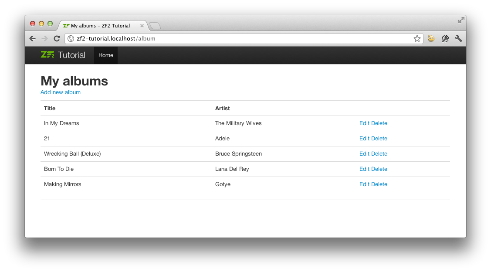

# 样式和翻译

打包 SkeletonApplication 的样式，但是我们需要改变标题和移除版权信息。

ZendSkeletonApplication 使用 `Zend\I18n` 的翻译功能来处理所有文字。它使用 `.po` 文件，文件存在 `module/Application/language`，你可以使用 [poedit](http://www.poedit.net/download.php) 来进行编辑。用 poedit 打开 `module/Application/language/en_US.po`。在 `Original` 设置列表中点击 Skeleton Application，然后输入 “Tutorial” 作为翻译的类型。


点击工具栏的保存按钮，poedit 将会创建一个 `en_US.mo` 文件。如果你不能找到 `.mo` 文件的话，点击 `Preferences -> Editor -> Behavior` 然后选中复选框 `Automatically compile .mo file on save`。

移除版权信息，我们需要编辑 `Application` 模块的 `layout.phtml` 视图脚本。

```php
 // module/Application/view/layout/layout.phtml:
 // Remove this line:
 <p>&copy; 2005 - 2014 by Zend Technologies Ltd. <?php echo $this->translate('All
 rights reserved.') ?></p>
```

现在这个页面看起来比之前苗条多了。


